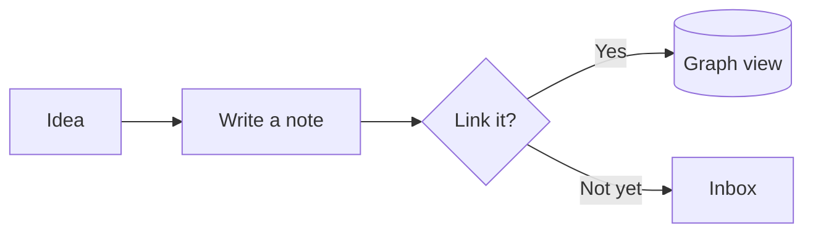
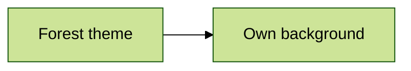

import { Callout } from 'fumadocs-ui/components/callout';
import { Mermaid } from '@/components/mermaid';

Ekphos renders Mermaid code blocks as diagrams directly in the content preview.
The syntax follows Obsidian, so diagrams written in an Obsidian vault render in
Ekphos without changes. Any diagram can open in a full-screen viewer where you
can zoom, pan, and compare it with Mermaid's own light and dark looks.

Diagrams are drawn by a native renderer built into Ekphos. You do not need a
browser, Node.js, or `mermaid-cli`.

## Syntax

Write the diagram in a fenced code block tagged `mermaid`:

````markdown

````

The block renders as:

<Mermaid
  chart={`flowchart LR
    Idea[Idea] --> Note[Write a note]
    Note --> Link{Link it?}
    Link -->|Yes| Graph[(Graph view)]
    Link -->|Not yet| Inbox[Inbox]`}
/>

The opening fence must start at the beginning of a line, and the block ends at
the next line that starts with three backticks. The `mermaid` tag can use any
letter case. A block that is empty or never closed stays a regular code block.

## Supported Diagrams

| Diagram | First line |
| ------- | ---------- |
| Flowchart | `flowchart` or `graph` |
| Sequence | `sequenceDiagram` |
| Class | `classDiagram` |
| State | `stateDiagram-v2` or `stateDiagram` |
| Entity relationship | `erDiagram` |
| Gantt | `gantt` |
| Pie | `pie` |
| Mindmap | `mindmap` |
| Timeline | `timeline` |
| User journey | `journey` |
| Git graph | `gitGraph` |
| Quadrant chart | `quadrantChart` |
| XY chart | `xychart-beta` or `xychart` |
| Sankey | `sankey-beta` or `sankey` |
| Block | `block-beta` or `block` |
| Packet | `packet-beta` or `packet` |
| Kanban | `kanban` |
| Requirement | `requirementDiagram` |
| C4 | `C4Context`, `C4Container`, `C4Component`, `C4Dynamic`, or `C4Deployment` |
| Radar | `radar-beta` or `radar` |
| Treemap | `treemap-beta` or `treemap` |
| Architecture | `architecture-beta` or `architecture` |
| ZenUML | `zenuml` |

Every diagram type also supports:

- YAML frontmatter with a `title` and a `config` block
- `%%{init: {...}}%%` directives, including `theme`, `themeVariables`,
  `fontFamily`, and `fontSize`
- `classDef`, `class`, and `style` for coloring individual nodes
- Markdown strings such as ``A["`**bold** and *italic*`"]``, HTML tags such as
  `<b>` and `<i>`, and entity codes such as `#quot;`
- `%%` comments, `accTitle`, and `accDescr`

## In the Note

Each diagram renders as a card titled with its type, such as **◇ Flowchart**.
Labels are drawn at about the size of terminal text, and the diagram is
centered in the card. A diagram that is too wide for the content panel, or
taller than [`diagram_height`](#diagram-height), shrinks to fit.

Rendering starts as soon as the note enters the content preview, even when
another panel has focus. A diagram shows **Rendering diagram…** for a moment the
first time it loads.

When the cursor is on a diagram, or the mouse is over it, the card border
changes color and shows **Enter to explore**.

### Colors

Diagrams use your [theme](/docs/themes): node fills, borders, lines, and text
come from the theme's accent and text colors, and the diagram sits on the note
background. Switching themes recolors every diagram.

A diagram that picks a Mermaid theme keeps it. Ekphos draws it on that theme's
own background, like a sheet of paper on the note:

````markdown

````

`themeVariables`, `classDef`, and `style` apply on top of the theme colors.

## Diagram Viewer

Press `Enter`, `Space`, or `o` on a diagram, or click it, to open it full
screen. The viewer starts with the whole diagram fitted to the window.

| Input | Action |
| ----- | ------ |
| `+` / `=` / `i` | Zoom in |
| `-` / `_` / `o` | Zoom out |
| Scroll wheel | Zoom toward the pointer |
| Double-click | Zoom in 2x where you clicked |
| `h` / `j` / `k` / `l`, arrow keys | Pan |
| `H` / `J` / `K` / `L`, `Shift` + arrow keys | Pan half a screen |
| Drag | Pan with the mouse |
| `g` / `G` | Jump to the top or bottom |
| `f` / `0` | Fit the diagram to the window |
| `1` | Show the diagram at actual size |
| `t` | Cycle the look: note theme, light, dark |
| `]` / `n` / `Tab` | Next diagram in the note |
| `[` / `N` / `Shift+Tab` | Previous diagram in the note |
| `e` | Edit the diagram's source |
| `y` | Copy the diagram's source |
| `?` | Show or hide the controls |
| `Esc` / `q` | Close the viewer |

The title shows the diagram type and its position in the note, such as
**2 of 5**. The bottom row shows the zoom level, the current look, and the
diagram's size. Scrollbars on the right and bottom edges appear once the
diagram is larger than the window.

<Callout>
  The viewer redraws the diagram at every zoom level, so text and lines stay
  sharp no matter how far you zoom in. Actual size (`1`) draws labels at about
  the size of terminal text.
</Callout>

### Looks

Press `t` to cycle between three looks:

| Look | Colors |
| ---- | ------ |
| Note theme | The same colors as the diagram in the note |
| Light | Mermaid's default theme on a white background |
| Dark | Mermaid's dark theme on a dark background |

Light and Dark show the diagram the way Mermaid draws it, which helps when a
diagram uses `style` or `classDef` colors chosen for a light background. The
look stays while you step through diagrams with `[` and `]`, and resets to the
note theme when you close the viewer.

## Editing

Diagrams are plain fenced code blocks, so they need no special editing
commands. Press `e` in the viewer to open the editor on the diagram's opening
fence, or edit the note as usual. Return to the content preview to see the
updated diagram.

## Errors

A diagram that Ekphos cannot render shows the parser's message above its
source, so you can see what to fix:

```text
╭ ◇ Flowchart ─────────────────────────────────────────────╮
│ ⚠ Couldn't render this diagram: parse error at line 2:   │
│ missing closing ']' for node 'A'                         │
│ flowchart LR                                             │
│     A[Unclosed bracket --> B                             │
╰──────────────────────────────────────────────────────────╯
```

The viewer shows the same message. Press `e` there to jump to the source. A
diagram with a syntax error never affects the rest of the note.

## Diagram Height

Set the tallest a diagram can be inside a note under `[general]` in
`~/.config/ekphos/config.toml`. The value is in terminal rows:

```toml title="config.toml"
[general]
diagram_height = 20
```

The default is `20`, and values below `4` are treated as `4`. Diagrams smaller
than the limit keep their natural size. The limit only applies inside the note;
the viewer always uses the full window. After editing the configuration, press
`Ctrl+Shift+R` to apply it without restarting Ekphos.

## Compatible Terminals

Rendered diagrams require one of the image protocols supported by Ekphos:

- iTerm2
- Kitty
- WezTerm
- Ghostty
- A Sixel-enabled terminal

<Callout type="warn">
  Terminals without an image protocol, such as Alacritty, draw diagrams with
  half-block characters, which are too coarse to read labels. If Ekphos cannot
  display images at all, each diagram card shows its Mermaid source instead and
  the viewer is unavailable.
</Callout>

## Differences from Obsidian

Ekphos draws diagrams with a native renderer instead of Mermaid.js, so a few
things differ from Obsidian:

- Node placement and edge routing can differ slightly, but every node, label,
  and connection is the same.
- Diagrams follow the Ekphos theme. Obsidian uses Mermaid's default or dark
  theme. Press `t` in the viewer to compare.
- Gantt task bars and section bands keep Mermaid's default colors in every
  theme.
- `click` links and callbacks do nothing, and there are no hover tooltips.
- A `mermaid` block inside a callout, a list item, or a `~~~` fence shows as
  text.
- Text uses a system sans-serif font, such as Helvetica or Arial, instead of
  Obsidian's interface font.
